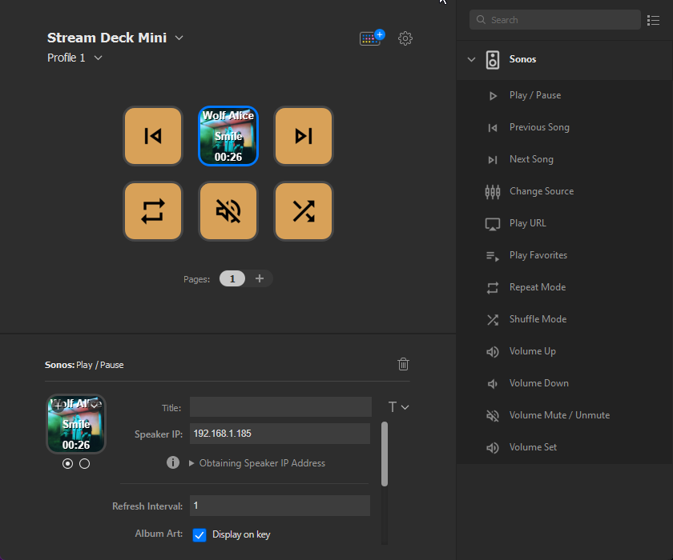

# Sonos Plugin for Elgato Stream Deck
Plugin which allows to control `Sonos` speakers and get live feedback.



# Features
- Code written in JavaScript
- Cross-platform (macOS, Windows)
- Play / Pause with Live Feedback (Album Cover, Artist, Title, Time)
- Previous & Next Track
- Change Input Source (Line In, TV, Queue)
- Play URL from Spotify, TuneIn, Tidal, Deezer and Apple Music
- Play Sonos Favorites
- Change Repeat & Shuffle Mode
- Change Volume

# Limitations
The plugin is written in JavaScript which makes it Cross-Platform compatible and can be trusted to not perform anything dangerous.  

However, this also comes with some limitations:
- Speaker Auto Discovery cannot be performed.  
The IP address of the speaker to control has to be entered manually but the IP can be easily retrieved from the Sonos App.
- Writing to Files not possible.
- Accessing the clipboard not possible.
- Can't listen to Push Notifications.  
The plugin has to poll for status changes.

# Installation
Download the plugin from the [Releases](https://github.com/GenericMale/streamdeck-sonos/releases/) section.

If you double-click the `com.genericmale.sonos.streamDeckPlugin` file on your machine, Stream Deck will install the plugin.

# Development
To generate the installation package, download the DistributionTool from the 
[Elgato Developer Documentation](https://developer.elgato.com/documentation/stream-deck/sdk/packaging/)
and run it in the project root folder:
```
.\DistributionTool.exe -b -i src\com.genericmale.sonos.sdPlugin -o release
```

A simple [bash script](generateImages.sh) is provided to generate all the images.  
The script requires ImageMagick to be installed and uses the [Material Design Icons](https://github.com/marella/material-design-icons).
